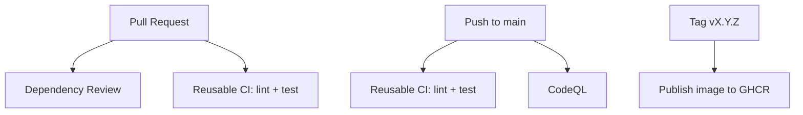

# github-actions-platform-pipelines

A template repo showing how to standardize CI/CD across teams using GitHub Actions.

## What it shows
- **Platform thinking**: one reusable CI workflow teams can consume
- **Automation mindset**: dependency review, CodeQL, publish on tags
- **Developer experience**: fast PR feedback, clear adoption steps, manual runs for debugging

## Core features
- GitHub Actions workflows:
  - Build + Test (reusable workflow)
  - Dependency scanning (Dependency Review + CodeQL)
  - Artifact publishing (publish container image to GHCR on version tags)
- Reusable workflow via `workflow_call`
- PR vs main separation
- Dependabot configuration (`.github/dependabot.yml`)
- CODEOWNERS support (optional but recommended)

## Quickstart (local)
```bash
python3.11 -m venv .venv
source .venv/bin/activate
python -m pip install --upgrade pip
pip install -e ".[dev]"

ruff check .
pytest -q
```

See: `docs/adoption-guide.md`

## Pipeline overview


